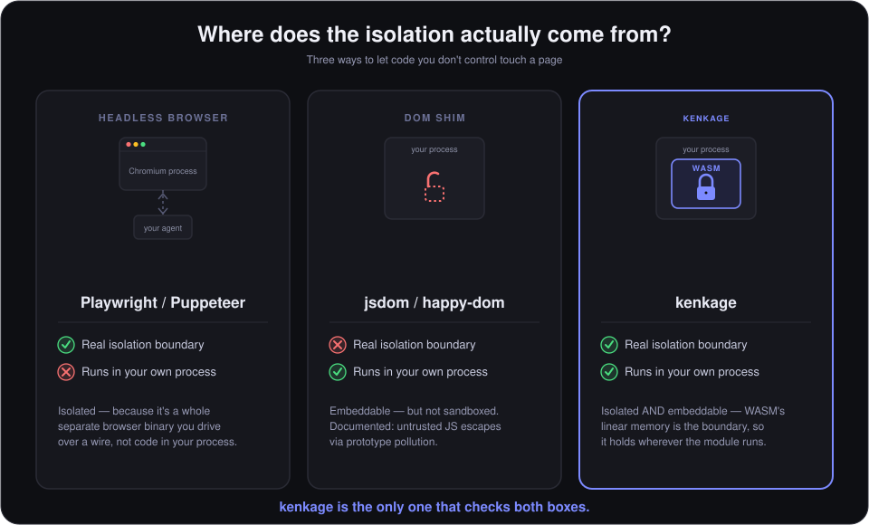

# kenkage



**We believe an agent's isolation shouldn't depend on how carefully you
babysit it — it should be a property of where its code physically runs.**

Right now, giving an AI agent the ability to read and act on a web page
means picking one of two trades: hand it a full browser process (Chromium
via Playwright/Puppeteer, or a cloud browser behind an API) and accept the
weight, the server, and the latency — or hand it a lightweight in-process DOM
shim (jsdom, happy-dom) and accept that it was never built to contain code
it didn't write. That second option isn't a small gap: happy-dom's own
maintainers have documented that untrusted JavaScript can escape its
sandbox via prototype pollution, even with `eval`/`Function` disabled. A DOM
implementation that merely *behaves* like a browser doesn't get a browser's
isolation for free.

kenkage closes that gap instead of picking a side of it. It compiles a real
DOM engine and a real JavaScript engine (QuickJS) to WebAssembly, so the
isolation comes from WASM's linear memory model — not from a spawned
process, not from a shim's best-effort discipline. That means it runs
**on-device**: inside a browser tab, inside an agent's own Node/Electron
process, at the edge — anywhere V8 or a WASM runtime already lives, with
no browser binary to install and no server in the loop.

```ts
import { createKenkage } from 'kenkage';

const engine = await createKenkage({ engine: 'full' });
await engine.init();

const page = await engine.loadPage('https://example.com');
console.log(page.title, page.text);
```

## Why

Most of the field has converged on the same two answers to "how does an
agent touch the web": scale up Chromium (Playwright, Puppeteer, managed
cloud browsers), or scale down the DOM (jsdom, happy-dom, linkedom). The
first treats isolation as something you buy with infrastructure — more
containers, more browser instances, more orchestration. The second treats
it as optional, because a DOM shim's job was always "pass the tests," not
"contain a hostile script."

We think that's backwards for agentic use. An agent parsing a page and
running the JavaScript it finds there — or JavaScript an LLM generated on
the fly — is running code from a source it doesn't control. That code
deserves a hard boundary by construction, not a process boundary you have
to provision, or a shim's goodwill. Compiling the engine itself to WASM is
how kenkage gets there: the boundary is the compilation target, so it holds
wherever the module runs.

## Features

- **Real DOM** — HTML parsing, CSS selector queries, node traversal, text and
  Markdown extraction.
- **Real JavaScript** — an in-WASM QuickJS engine (`engine: 'full'`) runs
  arbitrary JS against `document`/`Element` bindings, fully isolated from the
  host's own JS realm.
- **`loadPage()`** — fetches a URL, parses it, and runs every classic
  `<script>` on the page in document order (external and inline), draining
  promise microtasks and timers the way a real page load would.
- **No Chromium.** The entire engine — parser, DOM, CSS, JS — is ~4MB of
  WASM. No spawned browser process, no server-side rendering farm.
- **Two builds** — `core` (~650KB, HTML/DOM/CSS only) and `full` (adds
  QuickJS) — so callers that only need parsing don't pay for a JS engine.
- **Runs anywhere** — browser, Node, or Next.js (client, server component,
  or API route), via one package with four entry points.
- **Optional network bridge** (`kenkage/bridge`) — a companion browser
  extension gives `loadPage()`/`fetch()` real cross-origin access from a
  browser tab, without a server, for the sites that don't send CORS headers.

## Install

```sh
npm install kenkage
```

## Quick start

### Vanilla JS / TS

```ts
import { createKenkage } from 'kenkage';

const engine = await createKenkage(); // engine: 'core' by default
await engine.init();

engine.parse('<h1>Hello</h1><p>World</p>');
engine.getTitle();          // ''
engine.getText();           // 'Hello World'
engine.getMarkdown();       // '# Hello\n\nWorld'
engine.querySelector('p');  // [nodeId]

engine.destroy();
```

### Running real JavaScript (`full` engine)

```ts
const engine = await createKenkage({ engine: 'full' });
await engine.init();

const { success, result } = await engine.eval('1 + 2');
// success: true, result: '3'
```

### Loading a live page like a browser tab

```ts
const engine = await createKenkage({ engine: 'full' });
await engine.init();

const page = await engine.loadPage('https://example.com');
page.title;             // parsed <title>
page.scriptsExecuted;   // number of <script> tags that ran
page.scriptErrors;      // any that threw
```

### React

```tsx
import { useKenkage } from 'kenkage/react';

function Page({ html }: { html: string }) {
  const { title, text, loading } = useKenkage(html);
  if (loading) return <p>Loading engine…</p>;
  return <div>{title}: {text}</div>;
}
```

A `KenkageProvider` / `useKenkageContext()` pair is also available for
sharing one engine instance across a component tree.

### Next.js (Server Components / API routes)

```ts
import { createKenkagePage } from 'kenkage/next';

export default async function Page() {
  const html = await fetch('https://example.com').then(r => r.text());
  const engine = await createKenkagePage(html);
  return <div>{engine.getTitle()}</div>;
}
```

`createKenkagePage` loads the WASM module once via `fs.readFileSync` and
reuses the instance across requests.

### Real network access from a browser tab (CORS)

`loadPage()`/`fetch()` in a real browser tab are subject to the same
same-origin policy any page's `fetch()` is — most third-party sites don't
send `Access-Control-Allow-Origin`, so a plain in-page fetch to them fails
with a CORS error. That's not a kenkage limitation; it's the browser
working as designed, and no on-device JavaScript can opt out of it.

The one sanctioned exception: browser extensions' background contexts are
documented as exempt from page-level CORS. `kenkage/bridge`, paired with
the companion extension in [`extension/`](extension), uses exactly that —
nothing routes through a server, the request still goes straight from the
browser, on the user's machine, to the URL asked for:

```ts
import { createKenkage } from 'kenkage';
import { isBridgeAvailable, createBridgeFetch } from 'kenkage/bridge';

const engine = await createKenkage({ engine: 'full' });
await engine.init();

const fetchFn = (await isBridgeAvailable()) ? createBridgeFetch() : undefined;
const page = await engine.loadPage('https://example.com', { fetchFn });
```

`isBridgeAvailable()` resolves `false` quickly if the extension isn't
installed, so this degrades to a plain (CORS-restricted) `fetch()`
automatically — the extension is a strict opt-in upgrade, never a hard
dependency. See [`extension/README.md`](extension/README.md) for what it
does, its safety limits (private-network blocking, rate limiting, response
caps), and the one thing it honestly can't fully defend against (DNS
rebinding — documented there, not hidden).

### Bundler consumers

kenkage locates its own `.wasm` file relative to `import.meta.url`, which
works out of the box in Node and in a browser loading it as a real ES
module. **webpack 5+ and Vite/Rollup** natively recognize the
`new URL('./file.ext', import.meta.url)` pattern as a static asset
reference — they'll copy the file alongside your bundle and rewrite the URL
correctly, even when kenkage's code is fully bundled in with yours.

**esbuild's `--bundle` does not** — as of esbuild 0.25, a `new URL(...,
import.meta.url)` call is left as plain runtime code, not statically
detected as an asset reference, regardless of `--loader:.wasm=file`. If
your build uses esbuild (or any other bundler without this convention) to
fully bundle kenkage's code, `import.meta.url` at runtime resolves to
*your* bundle's location instead of kenkage's installed one, and loading
will fail to find the file. Pass `wasmUrl` to override resolution
explicitly:

```ts
const engine = await createKenkage({
  wasmUrl: new URL('./node_modules/kenkage/dist/kenkage-core.wasm', import.meta.url).toString(),
});
```

Point it at wherever kenkage's `dist/` actually ends up relative to your
running code — for esbuild specifically, marking `kenkage` as `--external`
(so it's `require`/`import`-resolved normally at runtime instead of
inlined) avoids the problem entirely, if your setup allows it.

kenkage's Node-only code path (`fs.readFileSync`, gated behind a runtime
`isNode` check) is reached via a dynamically-computed `import()` specifier
rather than a literal `import('node:fs')`, specifically so bundlers don't
try to eagerly resolve it at build time when bundling kenkage for a
browser target that lacks `node:fs`. If you're on kenkage < 0.1.3 and hit
`Could not resolve "node:fs"` while bundling for a browser/non-Node
platform, upgrade — this is otherwise unavoidable in that pattern with a
literal specifier, since bundlers can't know a dynamic import is
runtime-guarded and unreachable on your target platform.

Point it at wherever kenkage's `dist/` actually ends up in your build output.

## `core` vs `full`

| | `core` | `full` |
|---|---|---|
| Size | ~650KB | ~4MB |
| HTML parsing, DOM, CSS selectors | ✅ | ✅ |
| `eval()` | delegates to the host's JS (`eval`/`Function`) | runs in an isolated in-WASM QuickJS engine |
| `loadPage()` (execute page `<script>`s) | ❌ | ✅ |

Pick `core` when you only need to parse and query HTML. Pick `full` when an
agent needs to execute page (or model-generated) JavaScript without handing
it your host's `eval()`.

## API

The full typed surface is in [`src/index.ts`](src/index.ts); the shape:

- `createKenkage(options?)` — instantiate the WASM engine.
- `engine.init()` / `engine.destroy()`
- `engine.parse(html)` → `boolean`
- `engine.getTitle() / getText() / getHtml() / getMarkdown() / getNodeCount()`
- `engine.querySelector(selector)` → node IDs
- `engine.nodeTag(id) / nodeText(id) / nodeAttr(id, name) / nodeChildCount(id) / nodeChildren(id)`
- `engine.eval(code)` → `{ success, result }`
- `engine.fetch(url, options?)` → `{ status, body }`
- `engine.loadPage(url, options?)` → parsed page + script execution report

## Architecture

- **Zig → WASM.** The engine (HTML tokenizer, DOM tree, CSS selector matcher,
  Markdown serializer) is written in Zig and compiled to
  `wasm32-freestanding` (`core`) or `wasm32-wasi` (`full`, since QuickJS
  needs libc). See [`src/zig/`](src/zig).
- **QuickJS in WASM.** The `full` build vendors and compiles
  [QuickJS](https://bellard.org/quickjs/) (MIT) as WASM alongside the Zig
  DOM engine, wired to `document`/`Element` bindings — see
  [`THIRD_PARTY_NOTICES.md`](THIRD_PARTY_NOTICES.md).
  Network access stays in the host: the WASM module raises a fetch request,
  the JS wrapper performs the real `fetch()`, and the response is delivered
  back into the sandbox.
- **Host bridge.** [`src/index.ts`](src/index.ts) instantiates the module,
  manages the shared linear-memory buffers used to pass strings across the
  WASM boundary, and exposes a typed async API over it.

## Building from source

Prebuilt WASM binaries ship in `src/dist/` and in the published npm package,
so `npm install` alone is enough to use kenkage. To rebuild the engine
itself you'll need [Zig 0.16+](https://ziglang.org/download/) on your `PATH`
(or set `ZIG=/path/to/zig`):

```sh
npm install
npm run build          # bundles src/ + copies src/dist/*.wasm → dist/
scripts/build-core.sh  # rebuild the 'core' WASM from Zig
scripts/build-full.sh  # rebuild the 'full' WASM (Zig + vendored QuickJS)
```

## Testing

```sh
npm test
```

Vitest exercises the compiled `core` WASM directly (parsing, selectors,
attributes, edge cases) — see [`src/__tests__/`](src/__tests__).

## Interactive demo

[`examples/browser-demo.html`](examples/browser-demo.html) is a static page
exercising both engine builds (HTML parsing, JS eval, fetch) in a browser.
Build first (`npm run build`), then serve `kenkage/` with any static file
server and open `examples/browser-demo.html`.

## Contributing

See [`CONTRIBUTING.md`](CONTRIBUTING.md).

## License

MIT — see [`LICENSE`](LICENSE). Vendors QuickJS (MIT); see
[`THIRD_PARTY_NOTICES.md`](THIRD_PARTY_NOTICES.md).
